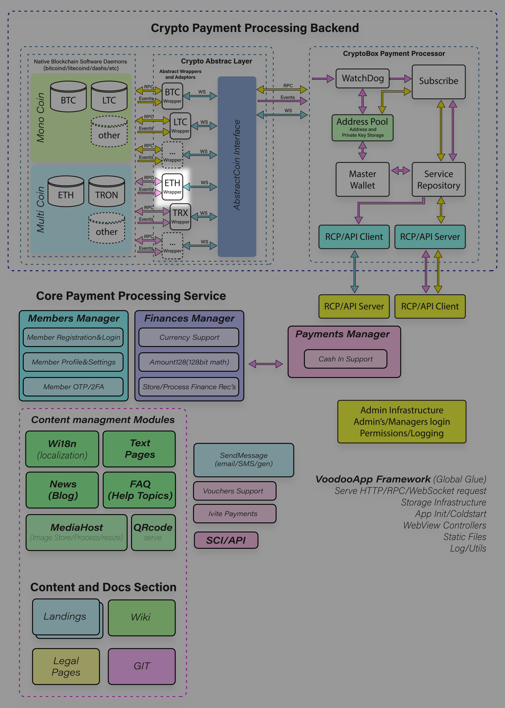

# EthBackNode

<p align="center">
  
</p>


**Backend microservice for interacting with Ethereum nodes, including transaction monitoring and transfers.**

> **Note**
>
> This project is currently focused on the **Ethereum blockchain** and its ecosystem.
>
> If you require support for other blockchains such as **TRON**, **BSC (Binance Smart Chain)**, or additional networks, feel free to **contact the author** to discuss possible extensions, custom implementations, or contributions.


## Overview

`ethbacknode` is a backend microservice written in **Golang** that acts as an intermediary layer between backend systems and Ethereum nodes.

Interaction with the service is performed via **JSON-RPC 2.0**, allowing seamless integration with existing backend architectures and microservice-based systems.

The service provides functionality for monitoring blockchain activity, generating Ethereum addresses, and sending transactions, including **ETH and ERC-20 token transfers**.

## What Problem This Project Solves

Building reliable backend systems on top of blockchain nodes is **non-trivial**.  
Direct interaction with Ethereum nodes requires handling low-level details such as RPC transport, block and transaction tracking, address subscriptions, confirmations, mempool states, and secure delivery of blockchain events to application backends.

**ethbacknode** addresses these challenges by acting as a **dedicated backend service** that:

- Abstracts low-level Ethereum node interaction (primarily via IPC).
- Continuously tracks blocks, transactions, and address activity.
- Normalizes blockchain events into a consistent, backend-friendly format.
- Delivers real-time notifications to client backends via HTTP callbacks or RPC.
- Separates blockchain infrastructure concerns from business logic.

In short, ethbacknode allows application developers to **focus on product and business logic**, while delegating blockchain-specific complexity, reliability, and monitoring to a specialized service.

---

### When NOT to Use It

While **ethbacknode** is designed to simplify and harden backend interaction with Ethereum nodes, it is **not a universal solution** for all blockchain-related use cases.

You should **avoid using ethbacknode** in the following scenarios:

- **Frontend or client-side applications**  
  ethbacknode is a backend infrastructure service and is not intended to be exposed directly to browsers or untrusted clients.

- **Simple or one-off scripts**  
  If you only need to query blockchain data occasionally (e.g. a single balance check or transaction lookup), directly using `geth` JSON-RPC or a hosted provider may be simpler.

- **Highly containerized / serverless environments**  
  ethbacknode is optimized for **IPC-based communication with geth**, which does not fit well with ephemeral, serverless, or heavily containerized platforms.

- **Multi-blockchain aggregation in a single process**  
  The service intentionally focuses on **Ethereum only**. If you require unified handling of many heterogeneous blockchains in one binary, a different architecture may be more appropriate.

- **Custodial systems without strict security controls**  
  If your environment cannot guarantee secure handling of private keys, mnemonics, and callback endpoints, running ethbacknode without additional safeguards is discouraged.

In these cases, alternative approaches such as direct RPC usage, managed blockchain APIs, or purpose-built multi-chain platforms may be a better fit.


## Technology Stack

- **Language:** Golang
- **Service Interface:** JSON-RPC 2.0
- **Blockchain Integration:** Ethereum (EVM-compatible)
- **Ethereum Node Protocol:** Ethereum JSON-RPC

## Features

- 📡 **Transaction monitoring**
    - Track incoming and outgoing transactions
    - Monitor address activity
    - Retrieve transaction status and confirmations

- 🔐 **Ethereum address generation**
    - Generate new Ethereum addresses
    - Optional mnemonic (BIP-39) generation for created addresses
    - Backend-oriented key and mnemonic handling (implementation-dependent)

- 💸 **Transaction sending**
    - Native ETH transfers
    - ERC-20 token transfers
    - Gas and nonce management via Ethereum node RPC

- ⚙️ **Ethereum node interaction**
    - Compatible with standard Ethereum JSON-RPC nodes
    - Supports self-hosted and third-party RPC providers

## Architecture

`ethbacknode` is deployed as a standalone Go microservice:

- Exposes a **JSON-RPC 2.0 API** for client interaction
- Communicates internally with Ethereum nodes via Ethereum JSON-RPC
- Designed for backend-to-backend integration
```
[ Your Backend ]
|
JSON-RPC 2.0
|
[ ethbacknode (Go) ]
|
Ethereum JSON-RPC
|
[ Ethereum Node / RPC Provider ]
```


## System Architecture Overview

The diagram below illustrates the **overall architecture of the crypto payment processing platform**, of which **ethbacknode** is a core infrastructural component.

ethbacknode is responsible for interacting with the **Ethereum blockchain node (geth)**, receiving blockchain events (blocks, transactions), and forwarding them to the client backend via HTTP callbacks or RPC interfaces. It operates as part of a broader ecosystem that includes payment processing, address management, notification delivery, and administrative services.

This diagram is provided to give **architectural context** and to help understand how ethbacknode fits into the larger system, including:
- blockchain daemon integration,
- abstraction layers and wrappers,
- event subscription and delivery,
- and interaction with higher-level payment and service modules.

> **Note:** ethbacknode itself focuses strictly on blockchain interaction and event propagation. Other components shown in the diagram are out of scope of this repository and may belong to separate services or systems.


---


## Build & Run Example

### Build from source

Clone the repository and build the binary:
```bash
git clone https://github.com/ITProLabDev/ethbacknode.git  
cd ethbacknode  
go build -o ethbacknode
```

### Run the service

Basic example of running the service:

./ethbacknode

The service will start and expose a JSON-RPC 2.0 endpoint for client backend interaction.

## Ethereum Node Connectivity

The recommended way to run **ethbacknode** is by connecting to a local Ethereum node via **IPC (`geth.ipc`)**, as this provides the best performance, lowest latency, and improved security compared to HTTP-based RPC.

When running ethbacknode inside Docker, IPC connectivity can be achieved by mounting the Ethereum data directory from the host or from a shared Docker volume:

## Architecture Notes

`ethbacknode` is designed to run **on the same host as the Ethereum node (geth)** and communicate with it via **IPC (`geth.ipc`)**.

This approach is considered a best practice for the following reasons:

- IPC provides lower latency and higher reliability compared to HTTP/WebSocket.
- No need to expose Ethereum node RPC endpoints over the network.
- Reduced attack surface and simpler security model.
- Direct filesystem-level access to the IPC socket.

Because of this design choice, containerization via Docker is **not a primary goal** at the moment.

## Docker Status

At this stage, Docker support is intentionally postponed.

Key reasons:
- `ethbacknode` relies on direct access to `geth.ipc`, which is typically available only on the host filesystem.
- Mapping IPC sockets into containers introduces platform-specific complexity and reduces reliability.
- The service also performs **outgoing HTTP callbacks** to client backends (event notifications), which requires careful network and security design in containerized environments.

Docker support may be revisited in the future if a clear, secure, and maintainable deployment model is defined.

## API Interface

All client interactions with `ethbacknode` are performed via **JSON-RPC 2.0**.

The API supports operations such as:
- Monitoring transactions
- Querying address activity
- Generating Ethereum addresses and mnemonics
- Sending ETH and ERC-20 transactions

A detailed method specification will be provided in the API documentation.

## Configuration

Typical configuration parameters include:
- Ethereum RPC endpoint
- Network and chain ID
- Gas and confirmation strategy
- Key storage and signing settings

Configuration examples will be added as the project evolves.

## Security Notes

⚠️ **Important**

- Access to the JSON-RPC interface must be restricted
- Mnemonic phrases and private keys must be handled securely
- Signing endpoints should never be publicly exposed

## TODO / Roadmap

- [ ] Configuration via environment variables
- [ ] Migrate configuration to HCL (HashiCorp Configuration Language) format
- [x] Basic token-based API authorization
- [ ] CI pipeline (linting, tests, builds)
- [ ] Logging subsystem refactoring (switch to structured logging)
- [ ] Re-evaluate Docker support with IPC-safe deployment model
- [ ] Review security model for outbound HTTP callbacks (event delivery)
- [ ] Move JSON-RPC stack to separate package 

# ethbacknode JSON-RPC 2.0 API

## API Overview

This document describes all **available API methods** and **event notifications** provided by the service.

The API is exposed via **JSON-RPC 2.0** and allows the client backend to interact with the blockchain, manage addresses, query transactions, send transfers, and receive asynchronous blockchain events.

See **API.md** for more details.

---

## Available Methods

### Service & System

- `ping` — Health check of the service
- `info` — Get blockchain and network information
- `infoGetTokenList` — Get list of supported currencies and tokens
- `infoGetBlockNum` — Get current blockchain block number

---

### Service Configuration

- `serviceConfigSet` — Configure service settings and event delivery parameters
- `serviceConfigGet` — Get current service configuration *(reserved)*

---

### Address Management

- `addressSubscribe` — Subscribe an address for blockchain notifications
- `addressGetNew` — Generate a new address and subscribe it
- `addressRecover` — Restore address data from a mnemonic *(no subscription)*
- `addressGetBalance` — Get address balances

---

### Transaction Queries

- `transferInfo` — Get detailed information about a transaction
- `transferInfoForAddress` — Get list of transactions for an address

---

### Transfers

- `transferAssets` — Send native coins or supported tokens
- `transferGetEstimatedFee` — Estimate network fee for a transfer

---

## Event Notifications

Event notifications are delivered asynchronously to the client backend via configured callback URL using **JSON-RPC 2.0**.

### Blockchain Events

- `blockEvent` — Notification about a new blockchain block

---

### Transaction Events

- `transactionEvent` — Notification about incoming or outgoing transactions  
  *(mempool, confirmation updates, and final confirmation states)*

---

## Notes

- All numeric blockchain values are provided as **big integers** unless explicitly stated
- Event delivery is **at-least-once**; clients must handle deduplication
- Critical actions and event payloads should always be verified using query methods

---

This overview serves as an entry point for the detailed sections below.

---

## General Information

- **Protocol:** JSON-RPC 2.0
- **Transport:** HTTP / HTTPS
- **Content-Type:** `application/json`

---

## Status

🚧 Project is under active development.  
Interfaces and internal behavior may change.

## 🙏 Acknowledgements

This project would not be possible without the tremendous work of the open-source blockchain community.

We would like to express our sincere gratitude to:

- **Ethereum Foundation & Ethereum Contributors**  
  For developing and maintaining the Ethereum protocol, the `geth` client, and the surrounding ecosystem that makes reliable Ethereum node interaction possible.

- **Bitcoin Core Developers**  
  For their foundational work on Bitcoin, its reference implementation, and the principles of decentralized, secure, and transparent blockchain systems that inspired the entire industry.

Their dedication to open-source software, security, and decentralization is a cornerstone of this project and many others in the blockchain ecosystem.

Thank you for building the tools that empower developers worldwide. 🚀

## Need Customization or Production Setup?

If your use case goes beyond the default scope of **ethbacknode**, you may require additional customization or production-grade hardening.

Typical scenarios where customization may be needed include:

- Supporting **additional blockchains** (e.g. TRON, BSC, or other EVM-compatible networks)
- Adapting the service to an existing **payment, custody, or wallet infrastructure**
- Implementing **custom security requirements** (HSM/KMS integration, external signing services, strict key isolation)
- Designing a **high-availability setup** (failover strategies, redundancy, monitoring)
- Integrating with **enterprise environments** (custom logging, metrics, alerting, CI/CD, deployment automation)

If you are planning to run ethbacknode in a **production environment** or need tailored functionality, feel free to **contact the author** to discuss architecture, customization options, or long-term support.

Collaboration, contributions, and well-defined extension proposals are always welcome.


## License

This project is open-source and distributed under the license specified in the repository.
